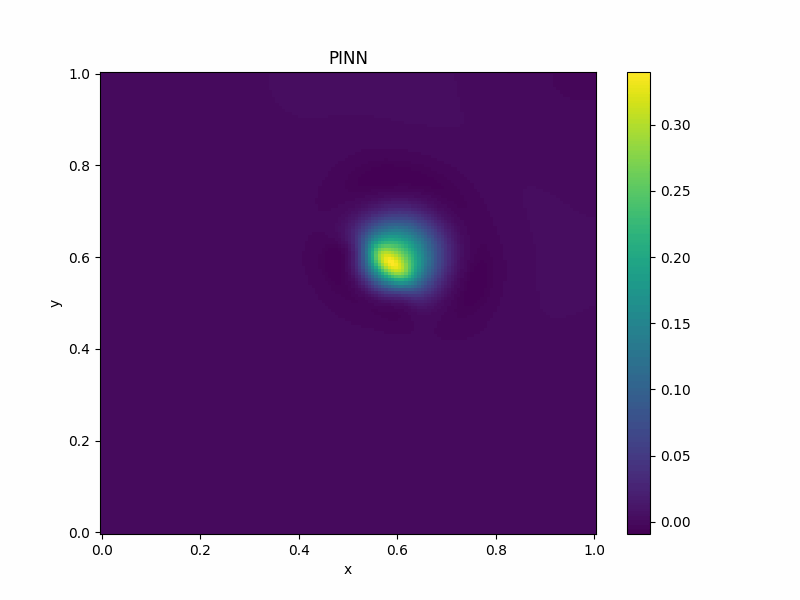
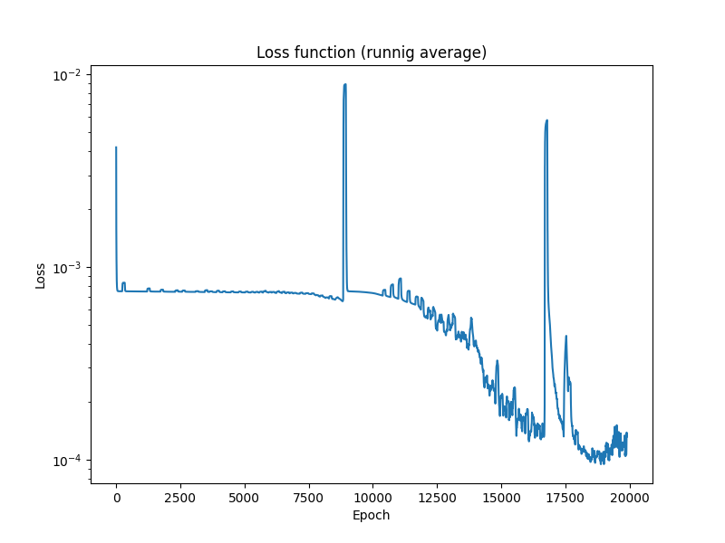

# Approximating giloma growth using PINN
## Approximated giloma growth
Presented Physics Informed Neural Network managed to learn giloma growth below.

## Training
Chart below presents how loss function changed during training.

